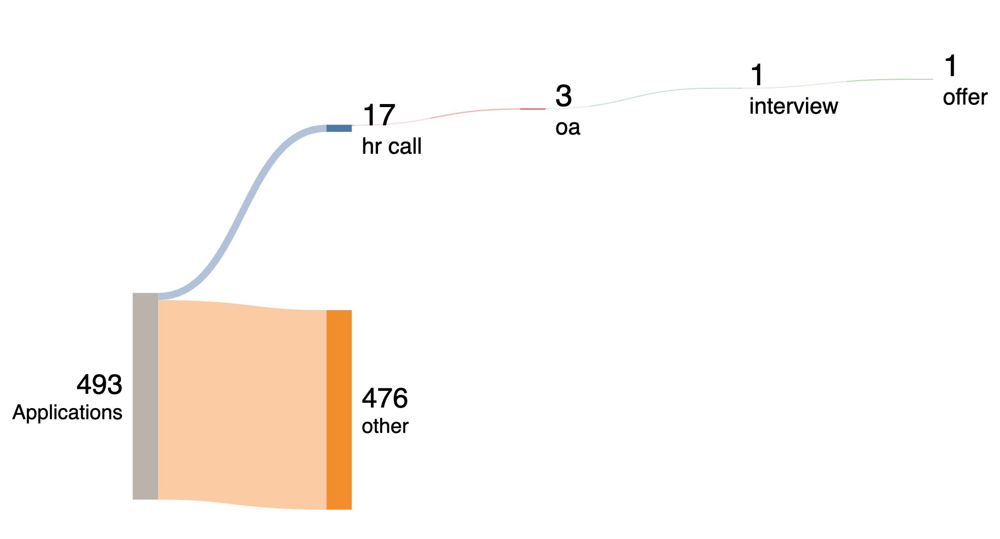

有存档的是投了 493 个职位，17 个 HR call，3 个 OA，1 个 system design / code interview / leadership interview。

庆祝自己成为连续三次找工第一次面试就拿到 offer 的人！

距离上次找工已经过了好久所以又在不断试错。

## 1）简历

总之第一步就是改简历，参考了很多这里的信息，简历模板也是这里找的：[r/EngineeringResumes Wiki](https://www.reddit.com/r/EngineeringResumes/wiki/index/#wiki_bullet_points)。

因为我的目标是多个不同职位所以一开始用 Word 做了好几个版本，后来发现改起来太麻烦，后面就转去用 LaTeX 了（用的是这个在线编辑器 [Overleaf](https://www.overleaf.com/)），搭配 GPT 改起来快很多。

最开始的简历完全是石沉大海，也试过 LinkedIn 上联系人，一样没结果，后来改了 2–3 次以后才开始有点回音。

## 2）OA / assessment

要求复杂或者要求不明确（比如遇到一个给了4个需求然后说能做多少做多少的）的 take home 可以直接放弃，我个人觉得只是浪费时间，固定时间固定题目类型的可以做。

## 3）技术面

我面了 system design 和 coding interview，没啥好说的，SD 就是八股文，背就行；coding interview 的话我这次准备了但根本没用上（很神奇的是以前两次找工的时候也都根本没用上……白刷了三次leetcode😂）有条件的话和别人 mock interview 练习效果会好很多。

- 准备 SD 时用的白板：[Excalidraw](https://excalidraw.com/)
- 准备 SD 用的材料：[Hello Interview — System Design in a Hurry](https://www.hellointerview.com/learn/system-design/in-a-hurry/introduction)

我是周一做的第一轮 BQ 面周二收到下一轮邀请，安排在次周一做的 SD 面，在这时对 SD 的了解基本是 0，临时抱佛脚一周也能答到基本过关的水平。

## 4）Leadership / BQ 面

[r/EngineeringResumes Wiki](https://www.reddit.com/r/EngineeringResumes/wiki/index/#wiki_bullet_points) 多准备即可。

## 5）Offer

没啥可说的了，找工市场不好，找到一个比我现在工作各方面都强得多的我就接了。
